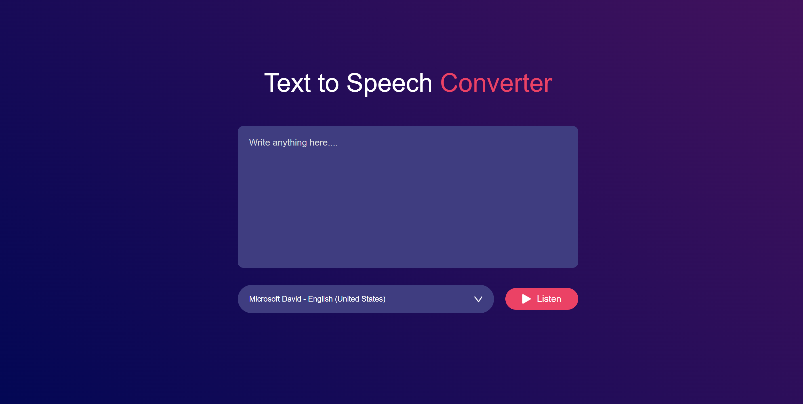

# 🗣️ Text-to-Voice Converter

## 📌 Overview
This is a simple Text-to-Voice Converter built using HTML, CSS,  and JavaScript. The application allows users to enter text into a text area and convert it into speech using the Web Speech API.

## 📷 Screenshot


## ✨ Features
- 🔊 Convert text input into speech.
- 🎙 Select different voices.
- ▶️ Play speech.

## 🛠️ Technologies Used
- 🌐 HTML
- 🎨 CSS
- 📜 JavaScript (Web Speech API)

## 📖 How to Use
1. Open `index.html` in a web browser.
2. Enter text into the text area.
3. Select a voice (optional).
4. Click the "Listen" button to hear the text.

## 📂 Project Structure
```
text-to-voice/
│── index.html       # Main HTML file
│── styles.css       # CSS file for styling
│── script.js        # JavaScript file for functionality
└── README.md        # Project documentation
```

## ⚙️ Installation
No installation is required. Simply download the files and open `index.html` in a browser.

## 🌍 Browser Compatibility
This project works best in modern browsers like Chrome, Edge, and Firefox. Some features may not be available in older browsers.


